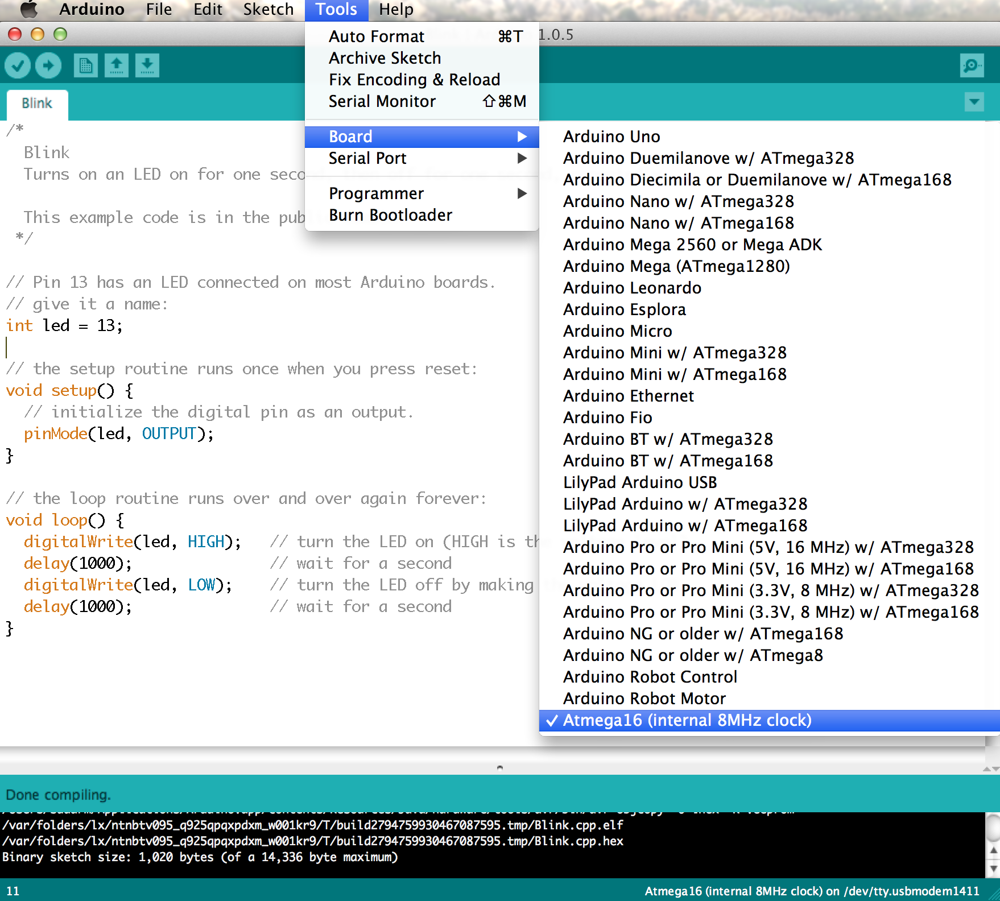

Extra cores for Arduino
=======================

This repo contains Arduino core for non Arduino AVR chips. Right now the following chips are supported.

- ATmega 16
- ATmega 16A

_Support for more chips will be added soon_

Using these extra cores, you can program the corresponding AVR chip using Arduino.

Installation
-------------

**Note**: _Right now this core works only with Arduino 1.0.x and support for Arduino 1.5.x is in the works_

To install these additional cores, download or checkout the project from github and then copy the `arduino-extra-core` directory to the `/hardware` folder of your sketchbook folder and then restart the Arduino IDE. You can name the subdirectory in /hardware anything you like.
If the directory hardware does not exists, you can create it first.

After the restart, you should be able to see the new boards under the boards menu. Select the board which you want to program.

Add support for more microcontrollers
-------------------------------------

If you want to add support for more microcontrollers, then follow [this guide](http://hardwarefun.com/tutorials/use-arduino-code-in-non-arduino-avr-microcontroller), where I explain how to add support for more microcontrollers.

If you want to program these micro controllers using Arduino as an ISP programmer, then follow [this guide](http://hardwarefun.com/tutorials/use-arduino-as-an-isp-programmer-to-program-non-arduino-avr-microcontrollers).

Contribution
-------------

All contributions (even documentation) are welcome :) Open a pull request and I would be happy to merge them. If you are not comfortable with git/github then checkout this guide which explains [how to contribute to github projects](http://sudarmuthu.com/blog/contributing-to-project-hosted-in-github).

If you are looking for ideas to work on, then check out the following TODO items or the [issue tracker](https://github.com/sudar/arduino-extra-cores/issues).

TODO
----

- Add support for more microcontrollers
- Getting started guide
- Better documentation
